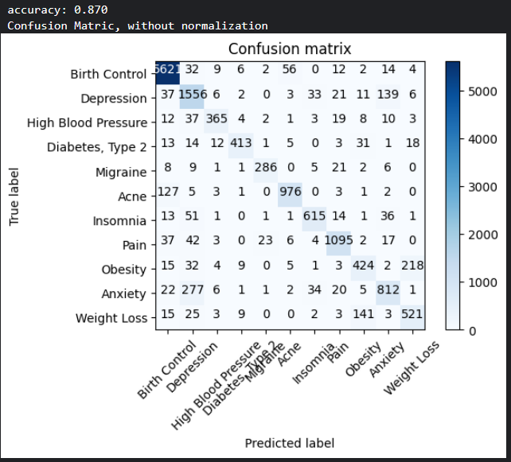
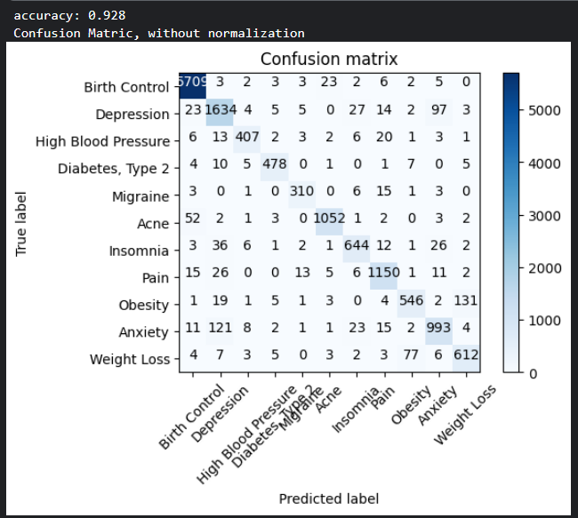

# Disease Condition Prediction Based on Drug Reviews
This repository contains a machine learning project that predicts medical conditions based on user drug reviews. By analyzing textual reviews from patients, the goal is to classify them into the correct disease condition using Natural Language Processing (NLP) and classification algorithms.

The model can be accessed from here : https://drive.google.com/drive/folders/1OU9q-nsJgYFLFn63RJI6F230gB7afGTX?usp=sharing

The dataset used in this project is sourced from the UCI Machine Learning Repository:

    Dataset Name: Drug Review Dataset (Drugs.com)
    Number of Instances: 215,063
    Number of Attributes: 6
    Associated Tasks: Classification, Regression, Clustering
    Date Donated: 2018-10-04

  ## Steps of NLP Pipeline
  The following steps were followed for text preprocessing and model building:

    Tokenize the sentences.
    Clean reviews:
        Remove punctuation
        Remove special characters/numbers
        Convert to lowercase
        Lemmatization
    Create Bag of Words (BoW) model to vectorize.
    Apply ML algorithms:
        Naive Bayes
        Passive Aggressive Classifier
    Create TF-IDF model to vectorize.
    Apply ML algorithms again.
    Compare the results of both vectorization techniques and classifiers.

Key Steps:

    Load and explore dataset.
    Focus on the top 12 frequent conditions.
    Preprocess and clean review text.
    Vectorize text (BoW, TF-IDF).
    Train classifiers and evaluate performance.

Data Preprocessing

    Dropped columns: Unnamed: 0, drugName, rating, date, usefulCount.
    Filtered dataset to 12 conditions:
        Birth Control, Depression, Pain, Anxiety, Acne, Bipolar Disorder, Insomnia, Weight Loss, Obesity, Diabetes Type 2, High Blood Pressure, Migraine.
    Vectorization Techniques:
        CountVectorizer (Bag of Words)
        TfidfVectorizer
🤖 Modeling

Models Used:

    Multinomial Naive Bayes
    Passive Aggressive Classifier

Evaluation Metrics:

    Accuracy
    Confusion Matrix

Results:
With BoW vectorization:
1. Naive Bayes gives the following result
  

  
  
<em>Naive Bayes on Bag of Words Tokenization</em>

   

2. Passive Aggressive Classifier gives the following  result
  

  
  
<em>Passive Aggressive Cassifier on Bag of Words Tokenization</em>

   

With TDIDF Tokenization:
1. Naive Bayes gives lesser accuracy than the previous tokenization

  
  
<em>Naive Bayes on TFIDF</em>

   

2. Passive Aggressive Classifier, on the other hand, gives greater accuracy on TFIDF

  
  
<em>Passive Aggressive Classifier on TFIDF</em>

   

   Increasing the n-gram of the TFIDF tokenizer, Passive Aggressive Classifier shows higher accuracy:
   On Bigram: 
   

  
  
<em>Passive Aggressive Classifier on Bi-gram TFIDF</em>

   

    On Trigram: 
   

  
  
<em>Passive Aggressive Classifier on Tri-gram TFIDF</em>

   

